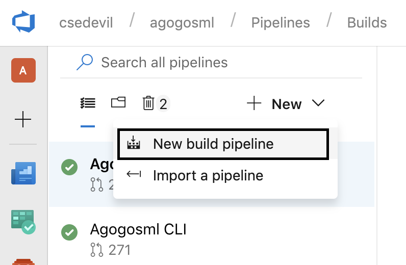
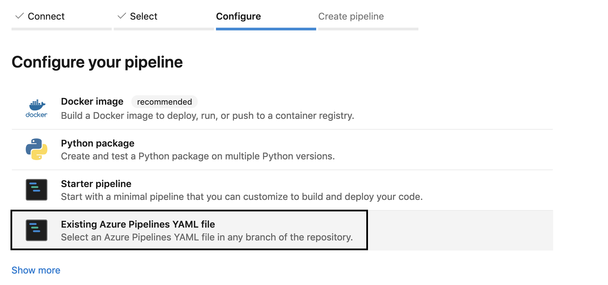
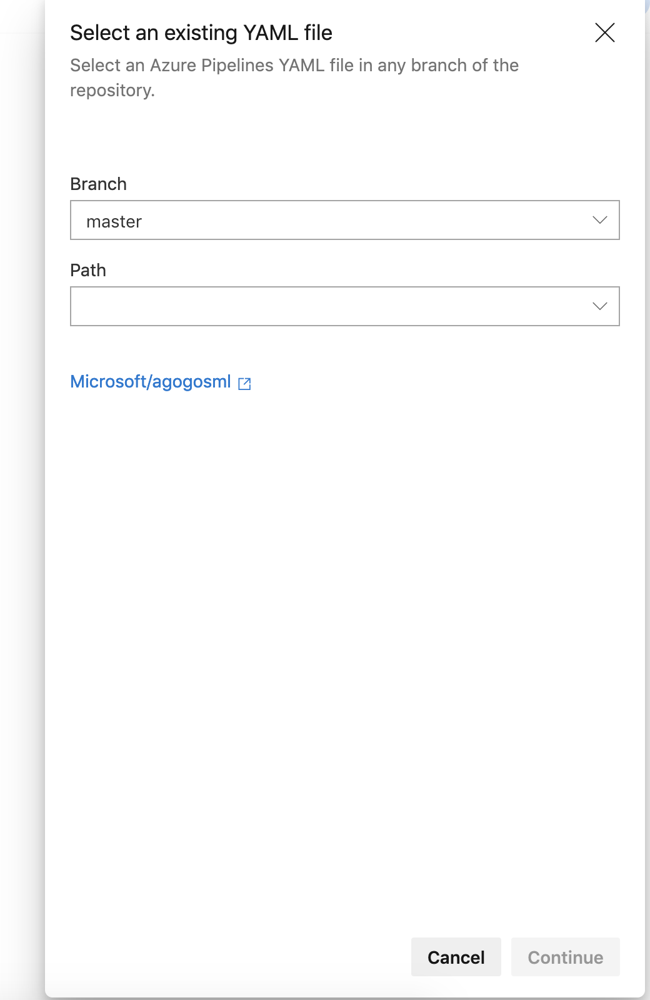
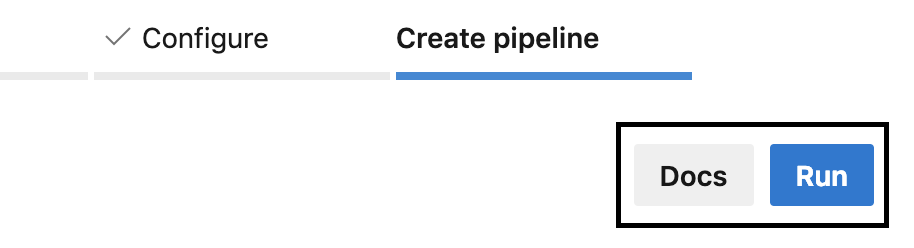

# README

This Agogosml project was generated by the Agogosml CLI using version {{cookiecutter.AGOGOSML_CLI_VERSION}}.

### Azure DevOps Project Setup

### Importing Azure DevOps Pipelines

1. Notice that there are three Azure DevOps pipeline files (.yml) that were generated for your project. You can use these pipelines
to setup continuous integration, end-to-end testing and continuous deployment of your agogosml project. 

2. Create an Azure DevOps project and a source control repository that can be accessed by your Azure DevOps instance.


### Creating Variable Groups for Azure DevOps Pipelines

1. The generated yaml file utilizes Variables that must be defined within a Variable group for the project. The variables used in the Variable Group canbe overriden using static variables - see [Variable Groups](https://docs.microsoft.com/en-us/azure/devops/pipelines/library/variable-groups?view=azure-devops&tabs=yaml) for more information - and see ensure you understand the section [Use a Variable Group](https://docs.microsoft.com/en-us/azure/devops/pipelines/library/variable-groups?view=azure-devops&tabs=yaml) for more details on overriding or removing a dependency on Variable groups

2. The default name is set in the yaml under `variables - group` as below. 

```yaml
variables:
- group: azure-subscription-1
```

3. When using groups additional pipeline variables need to be defined with the `name:... value:....` format as follows:

```yaml
variables:
- group: azure-subscription-1
- name: kafka_address
  value: 
- name: kafka_consumer_group
  value: '$Default'
- name: kafka_timeout
  value: '30'
- name: kafka_topic_input
  value: 'in'
- name: kafka_topic_output
  value: 'out'
```

### Importing Azure DevOps Pipelines

3. Use Azure DevOps 'New build pipeline' feature to import each of the pipelines (each yaml file). 
You will need to repeat steps 3 to 8 for each pipeline file. 

4. Select the source control repository you created that contains the pipeline files.

5. Once a repository is selected, you should be able to configure your pipeline by choosing 'Existing Azure Pipelines YAML file'. 

6. Select the path to the yml pipeline file and press continue. 

7. Click Run to complete setup for the pipeline. 

8. Specify the variables for the pipelines to be able successfully run the pipeline.


### Running the End to End Test

1. You can use the generated Azure DevOps Pipeline (`e2e-pipeline.json`) and import it to your Azure DevOps Pipeline.
2. Set all the correct environment variables
3. Queue the pipeline for build.

### Alternative: Running the End to End Test Locally

The following are instructions to run the end to end test locally. Even though you are running the tests
locally, they are still an end to end test and depend on deployed Azure resources. We also have a local Kafka
testing option below.

1. Make sure to set the following environment variables so that they may be correctly read by Docker Compose. For more information on where to find these variables, refer to our User Guide.

```bash
    export MESSAGING_TYPE=                          # eventhub/kafka
    export CONTAINER_REG=                           # this can be empty for local dev.
    export TAG=                                     # latest

    # Fill out if using Event Hubs as messaging service.
    export EVENT_HUB_NAMESPACE=
    export EVENT_HUB_NAME_INPUT=                    # Event Hub to receive incoming messages
    export EVENT_HUB_NAME_OUTPUT=                   # Event Hub to receive outgoing messages
    export EVENT_HUB_SAS_POLICY=                    # SAS Policy created for both input and output
    export EVENT_HUB_SAS_KEY_INPUT=                 # Key for input event hub SAS policy
    export EVENT_HUB_SAS_KEY_OUTPUT=                # Key for output event hub SAS policy

    export AZURE_STORAGE_ACCOUNT=                   # Storage account for Event Hub
    export AZURE_STORAGE_ACCESS_KEY=
    export LEASE_CONTAINER_NAME_INPUT=              # Container for input events
    export LEASE_CONTAINER_NAME_OUTPUT=             # Container for output events
    export EVENT_HUB_CONSUMER_GROUP=                # Default is $default

    # Fill out if using Kafka as messaging service.
    export KAFKA_ADDRESS=
    export KAFKA_TIMEOUT=
    export KAFKA_TOPIC_INPUT=
    export KAFKA_TOPIC_OUTPUT=
    export KAFKA_CONSUMER_GROUP=

    # Fill out if using Kafka Enabled Event Hubs Only. See instruction https://docs.microsoft.com/en-us/azure/event-hubs/event-hubs-create-kafka-enabled.
    # Ensure that EVENTHUB_KAFKA_CONNECTION_STRING is NOT set if you are using pure Kafka.

    export EVENTHUB_KAFKA_CONNECTION_STRING=        # Connection string-primary key in the Event Hub

    # Local SSL Certificate - only necessary to define path to local cert if you are running locally. i.e. something like /usr/local/etc/openssl/cert.pem
    export SSL_CERT_LOCATION=

    # Application Insights telemetry
    export APPINSIGHTS_INSTRUMENTATIONKEY=
```

2. Build the images for the base agogosml, input, output, and your application. We have provided a script for this named `dockerbuild.sh` in the root.

3. Once the images are built, run the Docker Compose file `docker-compose-agogosml.yml`. This file spins up the three images we just built, and it will also create a test generator application. The testgen app will generate and send events to the chosen streaming service (Eventhub, Kafka) that will be picked up by the input-reader and start the pipeline. Once the data is run through the custom application, and sent to the messaging service, we will print them for you to validate the process.

```bash
docker-compose -f docker-compose-agogosml.yml up --scale input-reader=2
```

The pipeline can also be run fully locally by using a containerized Kafka instance via:

```bash
docker-compose -f docker-compose-agogosml.yml -f docker-compose-agogosml.local.yml up
```

3. In order to execute the e-2-e test, a test generator app is required.
   You can use the included testgen app `docker-compose-testgen.yml` to execute the test.

Note: You have to run `docker-compose-agogosml.yml` before running `docker-compose-testgen.yml`

```bash
docker-compose -f docker-compose-testgen.yml up
```
