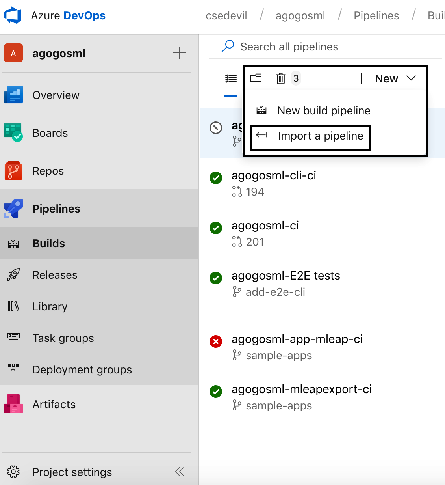
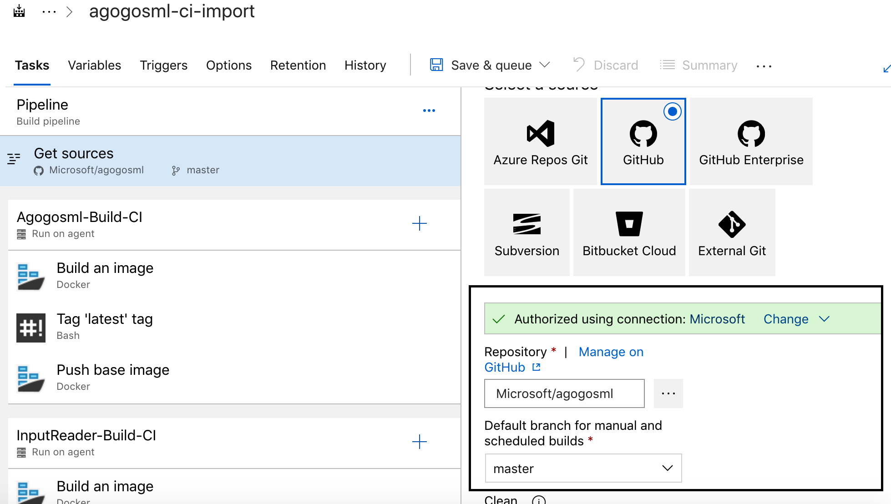
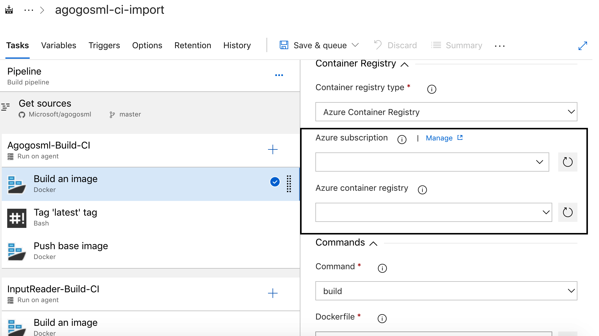

# Templates import instructions

1. Generate the pipelines definitions (.json)

2. Use Azure DevOps 'import pipeline' feature to import each of the pipelines (each json file) 

3. Follow the designer as it points the missing values (red exclamation point) and supply with valid values (repository connection string, agent pool, etc)  

4. for each build task, add the container registry and subscription id from the drop down 

5. Save