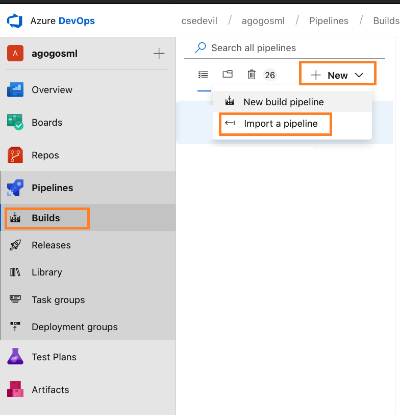

Using the generated Build & Release pipelines
=============================================

Prerequisites
-------------

-  Run the CLI generator. The expected output should be 3 json files
   representing 2 build azure devops pipelines:

   -  agogosml build
   -  application build

-  The third json represent the Release pipeline
-  Import all three files to Azure devops, save the imported pipelines.

|Builds| |Release|

Builds
------

Builds are scheduled based on pull requests to master. Whenever a new PR
is created a matching build will be triggered, creating a new image and
pushing it to the containers registry

|build example| |build logs|

Releases
--------

Release is a concrete definition of the deployed items. Including the
specific deployed images versions. Whenever a new version should be
deployed a new Release should be created.

Create a new release |image4| Fill in mandatory paramaters (i.e.
Artifcats & Variables values). Artifacts: Select the git repo who
contains the helm chart and the build of the version of the required
application. Variables: Fill in all the required values, such as the
agogosml images tag and EH, Kafka connection strings. |image5| Click on
'Deploy chart', the first step |image6| Click 'Deploy' |image7| Verify
info and click 'Deploy' |image8|

If all went well you should see in the logs all the steps marked with
success: |image9|

Evaluate the newly deployed release. If satisfied, deploy the 'accept'
stage, otherwise deploy the 'reject' stage. The accept will keep the
newly deployed version, deleting the previous one. The reject will
delete the newly deployed version keeping the previous one. |image10|

.. |Release| image:: ./_static/import-release.png
.. |build example| image:: ./_static/build-example.png

.. |image6| image:: ./_static/release-3.png

