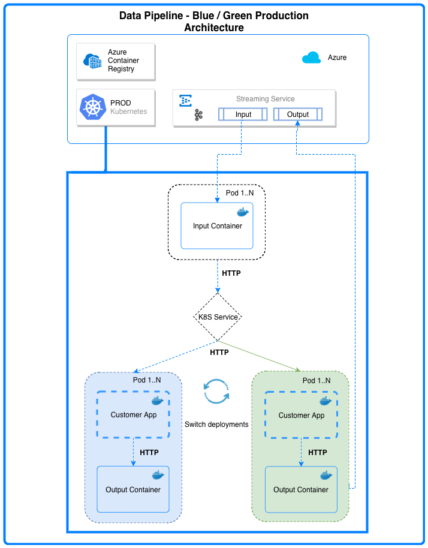

# Agogosml Design

- [Data Pipeline Building Block](#Data-Pipeline-Building-Block)
- [CI/CD Pipeline](#CI/CD-Pipeline)
- [Data Pipeline - Production Architecture](#Data-Pipeline---Production-Architecture)
- [Data Pipeline - Test Architecture](#Data-Pipeline---Test-Architecture)
- [Data Pipeline Building Block Description](#Data-Pipeline-Building-Block-Description)
- [Release Pipeline](#Release-Pipeline)

## Data Pipeline Building Block

The following is a basic, data pipeline, building block consisting of an <input, app, output> sequence. The input/output containers implement connector to various messaging services and act as a message proxy between the messaging services and the app container. This sequence removes the need to implement connector to various messaging services, and focus on building the business logic inside the app container while implementing a loosely coupled services approach.

- Input container - Receive events from Azure Event Hub / Kafka
- Customer App - Models implemented in PySpark, Tensorflow, scikit-learn and R.
- Output container - send the results of the models to Azure Event Hub / Kafka or other data source.

## CI/CD Pipeline

The CI/CD pipeline runs in Azure DevOps Pipelines. It consists of two separate pipelines, The Customer application and the Input/Output applications.

Each pipeline is triggered on code commit or PR:

- Clones the latest (or specific) branch of a Github repository.
- Build the repo.
- Run linting and unit tests.
- If all the tests have passed, push the new docker images to an Azure Container Registry.

## Data Pipeline - Production Architecture

The production architecture leverages the concept of [Kubernetes pods](https://kubernetes.io/docs/concepts/workloads/pods/pod/) to host and connect between the Input/Output containers and the customer container. Seperating the input container and application and output containers enables a rolling upgrade and Blue / Green deployment without downtime.

## Data Pipeline - Test Architecture

The test architecture runs both unit tests and integration tests locally on the test machine - In our case, the Azure DevOps machine. It runs the tested containers as well as the testing helper containers locally, while the testing container are responsible for pushing data into the pipeline and checking that the data coming from the other end of the pipeline is as expected.

## Data Pipeline Building Block Description

The following is a detailed description of the Data Pipeline Building Block and all the elements connecting between the different containers in this block.

## Release Pipeline

This Azure DevOps pipeline is responsible to build, validate and create new docker images of the data pipeline which will be deployed using another dedicated pipeline aka Release pipeline.

The release pipeline is focused on deploying the input, customer app and output containers and implementing B/G deployment **only** on the customer app.

B/G deployment enables the data scientist to verify the new model (Blue) without tearing down the old model (Green). Once the new model is approved, the old model will be deleted and the new model will be marked "Green"

The deployment is done via [Helm](https://helm.sh) chart and Azure DevOps release pipeline with manual approval process of the version.

