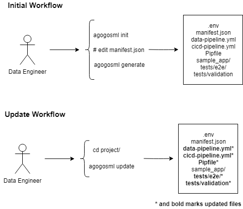

User Guide - Getting Started
============================

Before starting, please review agogosml `design`_

Prerequisites
-------------

-  Make sure to run bash (Linux/MacOS) or `WSL`_
-  Install `azure-cli`_
-  `Python 3.7`_
-  Optional: `Terraform`_ to provision Azure resources such as AKS and EventHub
-  `Docker`_
-  If you are on Linux/MacOS, please install GCC, Make, CMake and other relevant Python C Extension building tools.

Create a New Project
--------------------------------

.. code-block:: bash
    # 1. Installing the CLI
    pip install agogosml_cli

    # 2. Create a directory for your project
    mkdir hello-agogosml
    cd hello-agogosml

    # 3. Init the project
    agogosml init

    # 4. Fill in the manifest.json (Docker or Azure Container Registry, Azure Subscription, etc).
    vi manifest.json

    # 5. Generate the code for the projects. View options with the flag --help. 
    agogosml generate

The generated folder structure consists of the input reader, customer app and output writer as well as the Azure DevOps pipelines for CI/CD.

.. _app/model-integration-with-agogosml:

App/Model Integration with Agogosml
~~~~~~~~~~~~~~~~~~~~~~~~~~~~~~~~~~~

When you generated the project above, we include starter code for your application in either Python or Scala. 
To generate the project with a Scala application, run `agogosml generate --app-base mleap`. The default --app-base is `simple`,
which scaffolds a Python application to build off of. 

These base applications implement lightweight HTTP services that accept POST requests from the messaging service, and send the data via POST request to
the output messaging service. In this application, you would load a model, or do any desired transformation of the data. For instance, 
the Scala application loads in a sample Spark model using MLeap, and runs the incoming data through this model.  

You can find an example application
`here <https://github.com/Microsoft/agogosml/tree/master/agogosml_cli/cli/templates/apps/simple/%7B%7Bcookiecutter.PROJECT_NAME_SLUG%7D%7D>`__.

Local Building and Testing 
~~~~~~~~~~~~~~~~~~~~~~~~~~~

As you customize the base application that your data will run through, you should continuously test. You can find documentation and scripts to build and test 
this pipeline in the end to end testing folder, ``e2e/``. You will
build the scripts in ``dockerbuild.sh`` and run a docker-compose file that spins up the pipeline, along with a test generator.

Deployment and Provisioning with Azure
--------------------------------------

This pipeline can easily be deployed to Azure using the Terraform plans we provide. Please refer to our `documentation <https://github.com/Microsoft/agogosml/tree/master/agogosml_cli/cli/templates/%7B%7Bcookiecutter.PROJECT_NAME_SLUG%7D%7D/deployment/terraform>`__. 
for details on what to create and how. 

.. _Framework: https://github.com/Microsoft/agogosml/tree/master/agogosml
.. _CLI: https://github.com/Microsoft/agogosml/tree/master/agogosml_cli
.. _App: https://github.com/Microsoft/agogosml/tree/master/sample_app
.. _design: https://github.com/Microsoft/agogosml/blob/master/docs/DESIGN.rst
.. _WSL: https://docs.microsoft.com/en-us/windows/wsl/install-win10
.. _azure-cli: https://docs.microsoft.com/en-us/cli/azure/install-azure-cli?view=azure-cli-latest
.. _Python 3.7: https://www.python.org/downloads/release/python-371/
.. _Terraform: https://www.terraform.io/
.. _Docker: https://docs.docker.com/
.. _here: https://github.com/Microsoft/agogosml/blob/master/agogosml_cli/README.rst#agogosml-cli-usage
.. _instructions: https://github.com/Microsoft/agogosml/blob/master/agogosml/README.rst#overview
.. _Azure DevOps: https://azure.microsoft.com/en-us/services/devops/
.. _Azure Kubernetes Service: https://github.com/Microsoft/agogosml/tree/master/deployment/aks
.. _Azure Event Hub: https://github.com/Microsoft/agogosml/tree/master/deployment/eventhub

CLI and Scaffolding Tools
=========================

Overview
--------

The CLI and Scaffolding tools (agogosml_cli) was developed to help the
Data Engineer scaffold a project using agogosml and to generate sample
code, dependencies and configuration files. agogosml_cli will provide
commands to update the dependencies of the generated scaffold to the
latest agogosml version to help the Data Engineer keep their project up
to date.

Agogosml CLI Usage
------------------

.. code:: bash

   agogosml command [OPTIONS]

   CLI User Usage Flow

The Data Engineer installs the agogosml_cli and runs ``agogosml init``
to generate a manifest.json file. The data engineer will then modify the
manifest.json and add their configuration files. The data engineer runs
``agogosml generate`` to generate the agogosml project. The generated
scaffold will include the following files:

-  ``.env`` - This file will be read by the Pipfile and contains an
   initial array of keys= for you to fill out.
-  ``manifest.json`` - This file is the configuration file for
   agogosml_cli.
-  ``cicd-pipeline.yml`` - This yaml file will contain the Azure DevOps
   ci/cd pipeline for an agogosml project.
-  ``data-pipeline.yml`` - This yaml file will contain the Azure DevOps
   data pipeline for an agogosml project.
-  ``<YourApplicationName>/`` - This folder is where you will develop your
    custom application. Within it, we provide starter code, which contains a simple data 
    transformation app that demonstrates how to read from the InputReader and write to the 
    OutputWriter data pipeline components. We provide either a simple Python starter project,
    or a Scala project that loads a ML model using mleap. Specify which base you want to use
    by adding a flag ``agogosml generate --app-base BASE``. 
-  ``e2e/`` - This a directory containing end to end integration
   tests for your data pipeline. Please refer to the README.md in this folder.
-  ``deployment/helm_chart`` - Helm charts for deployment to Kubernetes.
-  ``deployment/terraform`` - Terraform plans to scaffold the necessary elements of your project.  

CLI Commands
~~~~~~~~~~~~

init - Creates a manifest.json file
^^^^^^^^^^^^^^^^^^^^^^^^^^^^^^^^^^^

.. code:: bash

   agogosml init [--force|-f] <folder>

``agogosml init <folder>`` will generate a manifest file that contains
all the configuration variables for an agogosml project. ``<folder>`` is
the folder you would like to give use for your agogosml project.

generate - Generates an agogosml project
^^^^^^^^^^^^^^^^^^^^^^^^^^^^^^^^^^^^^^^^

.. code:: bash

   agogosml generate
   agogosml generate <folder>
   agogosml generate [--config|-c]
   agogosml generate [--config|-c] <folder>

   alias: agogosml g

``agogosml generate`` will generate a scaffold of an agogosml project
based on a manifest file if found in the current or target folder or as
specified by ``--config``.

update - Updates an agogosml project
^^^^^^^^^^^^^^^^^^^^^^^^^^^^^^^^^^^^

.. code:: bash

   agogosml update
   agogosml update <folder>

``agogosml update`` will update a scaffolded agogosml project. It will
update the agogosml dependencies to the latest version.

