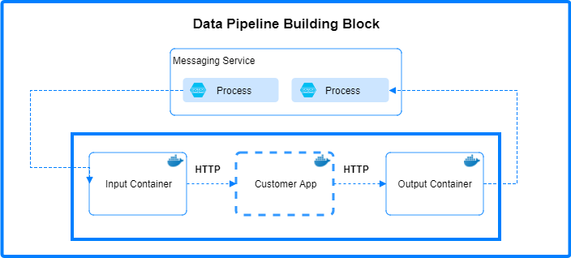
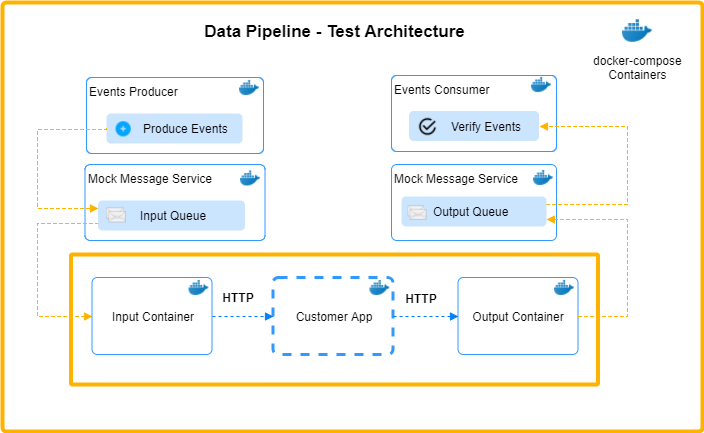

# CI/CD and Data pipeline design

## Architecture Diagram

### Basic Pipeline Building Block

### CI/CD

### Production Architecture

### Test Architecture

### Pipeline Building Blobk Description

## Overview

This Azure DevOps pipeline is responsible to build, validate and create new docker images of the data pipeline. This design is the 'Build' pipeline which produce the artifact of a validated and tagged new release, which will be deployed using another dedicated pipeline (Release).

In practice the pipeline is composed of multiple sub pipelines:

- Input/Output components build pipeline (Including UT and integration testing)
- Customer application build pipeline (Including UT and integration testing
- E2E testing pipeline

Each pipeline:

- Clones the latest (or specific) branche of a Github repository.
- Build the repo.
- Run linting and unit tests.
- Execute Integration/Validation/E2E tests.
- If all the tests have passed, push the new docker images to an Azure Container Registry.

## Requirements

- The Azure DevOps pipelines delivers a new tagged and verified release version
- The Sample Application container is a place holder for any customer application image. That image needs to answer to the following conditions:
  - Implement the HTTP endpoints protocol (TBD).
  - [Optional] Return message handling statuses to the input handler to enable a retry mechanism (Retry mechanism design is TBD)
- The Input/Output components handle the following areas of the data pipeline:
  - Connectivity to the different types of events sources, such as Azure EventHubs, Kafka and HTTP (for batching)
  - Retrying failed messages
- Logging and auditing libraries will be created to be used across all images
- The retry mechanism is optional and configurable
  - If enabled, a "Message Processed" confirmation is required

## Testing

- Each sub pipeline will consist of one or more testing procedures (unit tests/Integration)
- Once the sub pipelines are finished and tagged images are pushed to the container registry, E2E tests will run to validate the complete flow.
- Testing components are deployed on the same docker client as the Input/Output components and acts as both events producer and events consumer (such as EventHub mock)
  - communication is internal to the docker cluster and ensures sufficient performance
- The DevOps pipeline will continuously check the tests containers exit code and accordingly will decide if the new version is passed the validation

## Open issues

- Verify docker client can be run locally on a agent VM -> Done
- Verify Kafka/EH producers/consumers mocks are available