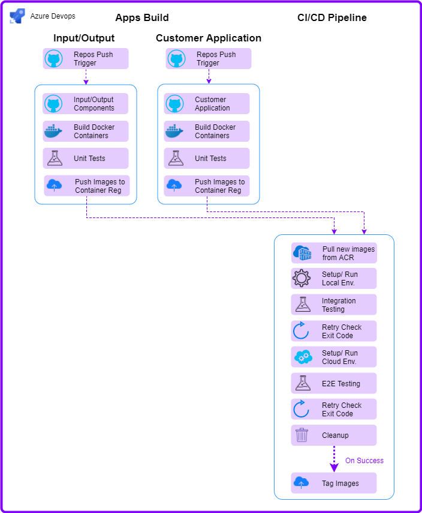
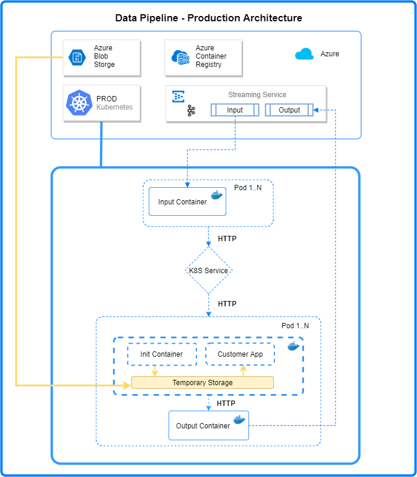
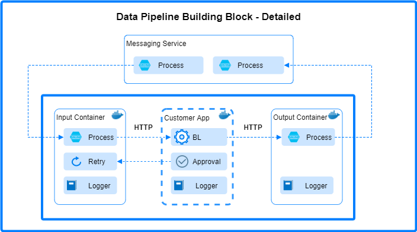

# CI/CD and Data pipeline design

# Architecture Diagram

## Data Pipeline Building Block

The following is a basic, data pipeline, building block consisting of an <input, app, output> sequence. The input/output containers implement connector to various messaging services and act as a message proxy between the messaging services and the app container. This sequence removes the need to implement connector to various messaging services, and focus on building the business logic inside the app container.

See [here](#pipeline-building-blobk-description) for a detailed diagram.

## CI/CD Pipeline

The CI/CD pipeline runs on Azure DevOps (also Azure Pipelines). It consists of three separate pipelines - The Customer application and the Input/Output applications. The pipelines are triggered on code commit and build the application while running unit tests. After the build is successful, the container images are pushed to Azure Container Registry (also ACR); The third pipeline, is triggered when a new image is pushed to the ACR, pulls the updated images, and runs both integration tests and E2E tests.

## Data Pipeline - Production Architecture

The production architecture leverages the concept of [Kubernetes pods](https://kubernetes.io/docs/concepts/workloads/pods/pod/) to host and connect between the Input/Output containers and the customer container.

## Data Pipeline - Test Architecture

The test architecture runs both unit tests and integration tests locally on the test machine - In our case, the Azure Devops machine. It runs the tested containers as well as the testing helper containers locally, while the testing container are responsibe for pushing data into the pipeline and checking that the data coming from the other end of the pipeline is as expected.

## Data Pipeline Building Block Description

The following is a detailed description of the Data Pipeline Building Block and all the elemets connecting between the different containers in this block.

# Overview

This Azure DevOps pipeline is responsible to build, validate and create new docker images of the data pipeline. This design is the 'Build' pipeline which produce the artifact of a validated and tagged new release, which will be deployed using another dedicated pipeline (Release).

In practice the pipeline is composed of multiple sub pipelines:

- Input/Output components build pipeline (Including UT and integration testing)
- Customer application build pipeline (Including UT and integration testing
- E2E testing pipeline

Each pipeline:

- Clones the latest (or specific) branch of a Github repository.
- Build the repo.
- Run linting and unit tests.
- Execute Integration/Validation/E2E tests.
- If all the tests have passed, push the new docker images to an Azure Container Registry.

# Requirements

- The Azure DevOps pipelines delivers a new tagged, tested and verified release version
- The Sample Application container is a place holder for any customer application image. That image needs to answer to the following conditions:
  - Implement the HTTP endpoints protocol [[See Issue](https://github.com/Microsoft/agogosml/issues/95)].
  - [Optional] Return message handling statuses to the input handler to enable a retry mechanism (Retry mechanism design is TBD)
- The Input/Output components handle the following areas of the data pipeline:
  - Connectivity to the different types of events sources, such as Azure EventHubs, Kafka and HTTP (for batching)
  - Retrying failed messages
- Logging and auditing libraries will be created to be used across all images
- The retry mechanism is optional and configurable
  - If enabled, a "Message Processed" confirmation is required

# Testing

- Each sub pipeline will consist of one or more testing procedures (unit tests/Integration)
- Once the sub pipelines are finished and tagged images are pushed to the container registry, E2E tests will run to validate the complete flow.
- Testing components are deployed on the same docker client as the Input/Output components and acts as both events producer and events consumer (mock event generators)
  - communication is internal to the docker cluster and ensures sufficient performance
- The DevOps pipeline will continuously check the tests containers exit code and accordingly will decide if a new version passed validation.

# Open issues

- Verify Kafka/EH producers/consumers mocks are available [See Issue]